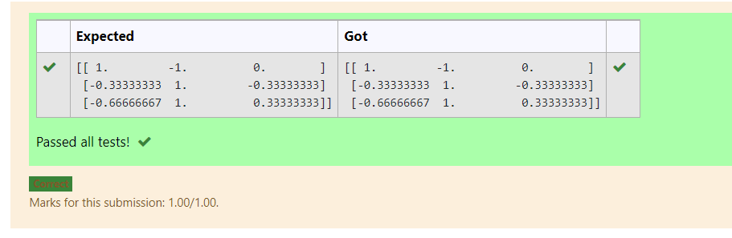

# INVERSE-OF-A-MATRIX
## Aim:
To write a python program to find the inverse of a matrix
## Equipment’s required:
1. 	Hardware – PCs
2. 	Anaconda – Python 3.7 Installation / Moodle-Code Runner
## Algorithm:
### Step1 : 
Import numpy library using import statement
### Step 2:
Using np.array(),create an array for the given matrix 
### Step 3: 
Using the np.linalg.inv(),we can find the inverse of given matrix
### Step 4:
Print the result and end the program 

## Program:
```
#Program to find the inverse of a matrix.
#Developed by: Logeshwari P
#RegisterNumber:21500746

import numpy as np 

  
# Taking a 3 * 3 matrix 

A = np.array([[2, 1, 1], 

              [1, 1, 1], 

              [1, -1, 2]]) 

  
# Calculating the inverse of the matrix 

print(np.linalg.inv(A))
```
## Output:

## Result:
Thus the inverse of given matrix is successfully solved using python program

